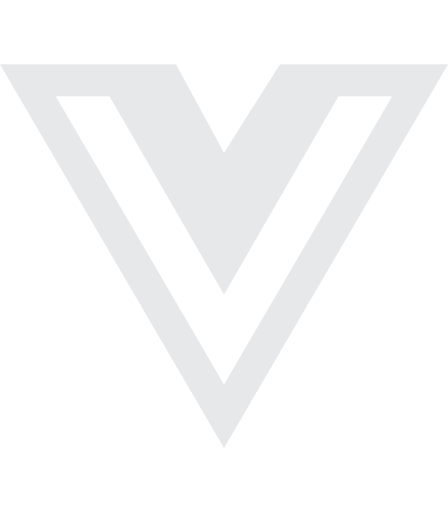

# File icons list

A working checklist of every file/folder icon the **makinda-file-icons** theme intends to ship. Tick (`[x]`) when the SVG lands in `icons/file-icons/`.

> Filenames in this list are the canonical icon names — the `iconDefinitions` keys in the theme JSON will use the same names without the `.svg`.

## Generic

- [ ] `file.svg` — fallback file
- [ ] `folder.svg` — fallback folder (closed)
- [ ] `folder-open.svg` — fallback folder (open)
- [ ] `folder-root.svg` — workspace root marker (optional)

| Name | VS Code | R·Bulk | R·Solid | R·Twotone | R·Duotone | R·Stroke | S·Duotone | S·Solid | S·Stroke | Sh·Solid | Sh·Stroke |
| --- | :---: | :---: | :---: | :---: | :---: | :---: | :---: | :---: | :---: | :---: | :---: |
| `file` fallback file |  | · |  | · | · | · | · | · | · | · | · |
| `folder` fallback folder (closed) |  | · |  | · | · | · | · | · | · | · | · |
| `folder-open` fallback folder (open) |  | · |  | · | · | · | · | · | · | · | · |
| `folder-root` workspace root marker (optional) |  | · | · | · | · | · | · | · | · | · | · |

## Languages & runtimes

### Web core

- [ ] `html.svg`
- [ ] `css.svg`
- [ ] `scss.svg`
- [ ] `sass.svg`
- [ ] `less.svg`
- [ ] `stylus.svg`
- [ ] `postcss.svg`
- [ ] `tailwind.svg`

| Name | VS Code | R·Bulk | R·Solid | R·Twotone | R·Duotone | R·Stroke | S·Duotone | S·Solid | S·Stroke | Sh·Solid | Sh·Stroke |
| --- | :---: | :---: | :---: | :---: | :---: | :---: | :---: | :---: | :---: | :---: | :---: |
| `html` |  | · |  | · | · | · | · | · | · | · | · |
| `css` |  | · |  | · | · | · | · | · | · | · | · |
| `scss` |  | · | · | · | · | · | · | · | · | · | · |
| `sass` |  | · | · | · | · | · | · | · | · | · | · |
| `less` |  | · | · | · | · | · | · | · | · | · | · |
| `stylus` |  | · | · | · | · | · | · | · | · | · | · |
| `postcss` |  | · | · | · | · | · | · | · | · | · | · |
| `tailwind` |  | · | · | · | · | · | · | · | · | · | · |

### JavaScript / TypeScript

- [ ] `javascript.svg` (`.js`, `.mjs`, `.cjs`)
- [ ] `typescript.svg` (`.ts`)
- [ ] `typescript-def.svg` (`.d.ts`)
- [ ] `react.svg` (`.jsx`, `.tsx`)
- [ ] `vue.svg`
- [ ] `svelte.svg`
- [ ] `astro.svg`
- [ ] `solid.svg`
- [ ] `angular.svg`

| Name | VS Code | R·Bulk | R·Solid | R·Twotone | R·Duotone | R·Stroke | S·Duotone | S·Solid | S·Stroke | Sh·Solid | Sh·Stroke |
| --- | :---: | :---: | :---: | :---: | :---: | :---: | :---: | :---: | :---: | :---: | :---: |
| `javascript` .js, .mjs, .cjs |  | · |  | · | · | · | · | · | · | · | · |
| `typescript` .ts |  | · |  | · | · | · | · | · | · | · | · |
| `typescript-def` .d.ts |  | · | · | · | · | · | · | · | · | · | · |
| `react` .jsx, .tsx |  | · | · | · | · | · | · | · | · | · | · |
| `vue` |  | · |  | · | · | · | · | · | · | · | · |
| `svelte` |  | · |  | · | · | · | · | · | · | · | · |
| `astro` |  | · |  | · | · | · | · | · | · | · | · |
| `solid` |  | · | · | · | · | · | · | · | · | · | · |
| `angular` |  | · | · | · | · | · | · | · | · | · | · |

### General-purpose

- [ ] `python.svg`
- [ ] `ruby.svg`
- [ ] `php.svg`
- [ ] `java.svg`
- [ ] `kotlin.svg`
- [ ] `scala.svg`
- [ ] `groovy.svg`
- [ ] `csharp.svg`
- [ ] `fsharp.svg`
- [ ] `cpp.svg`
- [ ] `c.svg`
- [ ] `objective-c.svg`
- [ ] `swift.svg`
- [ ] `go.svg`
- [ ] `rust.svg`
- [ ] `zig.svg`
- [ ] `dart.svg`
- [ ] `elixir.svg`
- [ ] `erlang.svg`
- [ ] `haskell.svg`
- [ ] `ocaml.svg`
- [ ] `clojure.svg`
- [ ] `lua.svg`
- [ ] `perl.svg`
- [ ] `r.svg`
- [ ] `julia.svg`
- [ ] `nim.svg`
- [ ] `crystal.svg`
- [ ] `fortran.svg`
- [ ] `cobol.svg`
- [ ] `pascal.svg`
- [ ] `assembly.svg`
- [ ] `solidity.svg`

| Name | VS Code | R·Bulk | R·Solid | R·Twotone | R·Duotone | R·Stroke | S·Duotone | S·Solid | S·Stroke | Sh·Solid | Sh·Stroke |
| --- | :---: | :---: | :---: | :---: | :---: | :---: | :---: | :---: | :---: | :---: | :---: |
| `python` |  | · |  | · | · | · | · | · | · | · | · |
| `ruby` |  | · |  | · | · | · | · | · | · | · | · |
| `php` |  | · |  | · | · | · | · | · | · | · | · |
| `java` |  | · |  | · | · | · | · | · | · | · | · |
| `kotlin` |  | · | · | · | · | · | · | · | · | · | · |
| `scala` |  | · | · | · | · | · | · | · | · | · | · |
| `groovy` |  | · | · | · | · | · | · | · | · | · | · |
| `csharp` |  | · | · | · | · | · | · | · | · | · | · |
| `fsharp` |  | · | · | · | · | · | · | · | · | · | · |
| `cpp` |  | · |  | · | · | · | · | · | · | · | · |
| `c` |  | · |  | · | · | · | · | · | · | · | · |
| `objective-c` |  | · | · | · | · | · | · | · | · | · | · |
| `swift` |  | · | · | · | · | · | · | · | · | · | · |
| `go` |  | · |  | · | · | · | · | · | · | · | · |
| `rust` |  | · |  | · | · | · | · | · | · | · | · |
| `zig` |  | · | · | · | · | · | · | · | · | · | · |
| `dart` |  | · | · | · | · | · | · | · | · | · | · |
| `elixir` |  | · | · | · | · | · | · | · | · | · | · |
| `erlang` |  | · | · | · | · | · | · | · | · | · | · |
| `haskell` |  | · | · | · | · | · | · | · | · | · | · |
| `ocaml` |  | · | · | · | · | · | · | · | · | · | · |
| `clojure` |  | · | · | · | · | · | · | · | · | · | · |
| `lua` |  | · | · | · | · | · | · | · | · | · | · |
| `perl` |  | · | · | · | · | · | · | · | · | · | · |
| `r` |  | · | · | · | · | · | · | · | · | · | · |
| `julia` |  | · | · | · | · | · | · | · | · | · | · |
| `nim` |  | · | · | · | · | · | · | · | · | · | · |
| `crystal` |  | · | · | · | · | · | · | · | · | · | · |
| `fortran` |  | · | · | · | · | · | · | · | · | · | · |
| `cobol` |  | · | · | · | · | · | · | · | · | · | · |
| `pascal` |  | · | · | · | · | · | · | · | · | · | · |
| `assembly` |  | · | · | · | · | · | · | · | · | · | · |
| `solidity` |  | · | · | · | · | · | · | · | · | · | · |

### Shell / scripting

- [ ] `bash.svg` (`.sh`, `.bash`)
- [ ] `zsh.svg`
- [ ] `fish.svg`
- [ ] `powershell.svg`
- [ ] `batch.svg` (`.bat`, `.cmd`)
- [ ] `nushell.svg`

| Name | VS Code | R·Bulk | R·Solid | R·Twotone | R·Duotone | R·Stroke | S·Duotone | S·Solid | S·Stroke | Sh·Solid | Sh·Stroke |
| --- | :---: | :---: | :---: | :---: | :---: | :---: | :---: | :---: | :---: | :---: | :---: |
| `bash` .sh, .bash |  | · | · | · | · | · | · | · | · | · | · |
| `zsh` |  | · | · | · | · | · | · | · | · | · | · |
| `fish` |  | · | · | · | · | · | · | · | · | · | · |
| `powershell` |  | · | · | · | · | · | · | · | · | · | · |
| `batch` .bat, .cmd |  | · | · | · | · | · | · | · | · | · | · |
| `nushell` |  | · | · | · | · | · | · | · | · | · | · |

## Markup, data & config

- [ ] `markdown.svg`
- [ ] `mdx.svg`
- [ ] `asciidoc.svg`
- [ ] `restructuredtext.svg`
- [ ] `tex.svg` (`.tex`, `.bib`)
- [ ] `json.svg`
- [ ] `jsonc.svg`
- [ ] `json5.svg`
- [ ] `yaml.svg`
- [ ] `toml.svg`
- [ ] `xml.svg`
- [ ] `csv.svg`
- [ ] `tsv.svg`
- [ ] `ini.svg`
- [ ] `env.svg` (`.env`)
- [ ] `dotenv.svg` (alias)
- [ ] `editorconfig.svg`
- [ ] `gitignore.svg`
- [ ] `gitattributes.svg`
- [ ] `gitmodules.svg`
- [ ] `npmignore.svg`
- [ ] `prettierrc.svg`
- [ ] `eslint.svg`
- [ ] `stylelint.svg`
- [ ] `babel.svg`
- [ ] `webpack.svg`
- [ ] `rollup.svg`
- [ ] `vite.svg`
- [ ] `parcel.svg`
- [ ] `esbuild.svg`
- [ ] `turbo.svg`

| Name | VS Code | R·Bulk | R·Solid | R·Twotone | R·Duotone | R·Stroke | S·Duotone | S·Solid | S·Stroke | Sh·Solid | Sh·Stroke |
| --- | :---: | :---: | :---: | :---: | :---: | :---: | :---: | :---: | :---: | :---: | :---: |
| `markdown` |  | · |  | · | · | · | · | · | · | · | · |
| `mdx` |  | · | · | · | · | · | · | · | · | · | · |
| `asciidoc` |  | · | · | · | · | · | · | · | · | · | · |
| `restructuredtext` |  | · | · | · | · | · | · | · | · | · | · |
| `tex` .tex, .bib |  | · | · | · | · | · | · | · | · | · | · |
| `json` |  | · |  | · | · | · | · | · | · | · | · |
| `jsonc` |  | · | · | · | · | · | · | · | · | · | · |
| `json5` |  | · | · | · | · | · | · | · | · | · | · |
| `yaml` |  | · |  | · | · | · | · | · | · | · | · |
| `toml` |  | · | · | · | · | · | · | · | · | · | · |
| `xml` |  | · |  | · | · | · | · | · | · | · | · |
| `csv` |  | · |  | · | · | · | · | · | · | · | · |
| `tsv` |  | · | · | · | · | · | · | · | · | · | · |
| `ini` |  | · | · | · | · | · | · | · | · | · | · |
| `env` .env |  | · | · | · | · | · | · | · | · | · | · |
| `dotenv` alias |  | · | · | · | · | · | · | · | · | · | · |
| `editorconfig` |  | · | · | · | · | · | · | · | · | · | · |
| `gitignore` |  | · | · | · | · | · | · | · | · | · | · |
| `gitattributes` |  | · | · | · | · | · | · | · | · | · | · |
| `gitmodules` |  | · | · | · | · | · | · | · | · | · | · |
| `npmignore` |  | · | · | · | · | · | · | · | · | · | · |
| `prettierrc` |  | · | · | · | · | · | · | · | · | · | · |
| `eslint` |  | · | · | · | · | · | · | · | · | · | · |
| `stylelint` |  | · | · | · | · | · | · | · | · | · | · |
| `babel` |  | · | · | · | · | · | · | · | · | · | · |
| `webpack` |  | · | · | · | · | · | · | · | · | · | · |
| `rollup` |  | · | · | · | · | · | · | · | · | · | · |
| `vite` |  | · | · | · | · | · | · | · | · | · | · |
| `parcel` |  | · | · | · | · | · | · | · | · | · | · |
| `esbuild` |  | · | · | · | · | · | · | · | · | · | · |
| `turbo` |  | · | · | · | · | · | · | · | · | · | · |

## Frameworks & ecosystems

- [ ] `nodejs.svg`
- [ ] `deno.svg`
- [ ] `bun.svg`
- [ ] `next.svg`
- [ ] `nuxt.svg`
- [ ] `remix.svg`
- [ ] `gatsby.svg`
- [ ] `nestjs.svg`
- [ ] `express.svg`
- [ ] `electron.svg`
- [ ] `tauri.svg`
- [ ] `expo.svg`
- [ ] `react-native.svg`
- [ ] `flutter.svg`
- [ ] `django.svg`
- [ ] `flask.svg`
- [ ] `fastapi.svg`
- [ ] `rails.svg`
- [ ] `laravel.svg`
- [ ] `dotnet.svg`
- [ ] `spring.svg`

| Name | VS Code | R·Bulk | R·Solid | R·Twotone | R·Duotone | R·Stroke | S·Duotone | S·Solid | S·Stroke | Sh·Solid | Sh·Stroke |
| --- | :---: | :---: | :---: | :---: | :---: | :---: | :---: | :---: | :---: | :---: | :---: |
| `nodejs` |  | · | · | · | · | · | · | · | · | · | · |
| `deno` |  | · | · | · | · | · | · | · | · | · | · |
| `bun` |  | · | · | · | · | · | · | · | · | · | · |
| `next` |  | · | · | · | · | · | · | · | · | · | · |
| `nuxt` |  | · | · | · | · | · | · | · | · | · | · |
| `remix` |  | · | · | · | · | · | · | · | · | · | · |
| `gatsby` |  | · | · | · | · | · | · | · | · | · | · |
| `nestjs` |  | · | · | · | · | · | · | · | · | · | · |
| `express` |  | · | · | · | · | · | · | · | · | · | · |
| `electron` |  | · | · | · | · | · | · | · | · | · | · |
| `tauri` |  | · | · | · | · | · | · | · | · | · | · |
| `expo` |  | · | · | · | · | · | · | · | · | · | · |
| `react-native` |  | · | · | · | · | · | · | · | · | · | · |
| `flutter` |  | · | · | · | · | · | · | · | · | · | · |
| `django` |  | · | · | · | · | · | · | · | · | · | · |
| `flask` |  | · | · | · | · | · | · | · | · | · | · |
| `fastapi` |  | · | · | · | · | · | · | · | · | · | · |
| `rails` |  | · | · | · | · | · | · | · | · | · | · |
| `laravel` |  | · | · | · | · | · | · | · | · | · | · |
| `dotnet` |  | · | · | · | · | · | · | · | · | · | · |
| `spring` |  | · | · | · | · | · | · | · | · | · | · |

## Databases

- [ ] `sql.svg`
- [ ] `postgres.svg`
- [ ] `mysql.svg`
- [ ] `sqlite.svg`
- [ ] `mongodb.svg`
- [ ] `redis.svg`
- [ ] `prisma.svg`
- [ ] `graphql.svg`

| Name | VS Code | R·Bulk | R·Solid | R·Twotone | R·Duotone | R·Stroke | S·Duotone | S·Solid | S·Stroke | Sh·Solid | Sh·Stroke |
| --- | :---: | :---: | :---: | :---: | :---: | :---: | :---: | :---: | :---: | :---: | :---: |
| `sql` |  | · | · | · | · | · | · | · | · | · | · |
| `postgres` |  | · | · | · | · | · | · | · | · | · | · |
| `mysql` |  | · | · | · | · | · | · | · | · | · | · |
| `sqlite` |  | · | · | · | · | · | · | · | · | · | · |
| `mongodb` |  | · | · | · | · | · | · | · | · | · | · |
| `redis` |  | · | · | · | · | · | · | · | · | · | · |
| `prisma` |  | · | · | · | · | · | · | · | · | · | · |
| `graphql` |  | · | · | · | · | · | · | · | · | · | · |

## DevOps, infra, cloud

- [ ] `docker.svg` (`Dockerfile`, `*.dockerfile`)
- [ ] `docker-compose.svg`
- [ ] `kubernetes.svg`
- [ ] `helm.svg`
- [ ] `terraform.svg`
- [ ] `ansible.svg`
- [ ] `vagrant.svg`
- [ ] `nginx.svg`
- [ ] `apache.svg`
- [ ] `aws.svg`
- [ ] `gcp.svg`
- [ ] `azure.svg`
- [ ] `vercel.svg`
- [ ] `netlify.svg`
- [ ] `cloudflare.svg`
- [ ] `firebase.svg`
- [ ] `supabase.svg`
- [ ] `github-actions.svg`
- [ ] `gitlab-ci.svg`
- [ ] `circleci.svg`
- [ ] `travis.svg`
- [ ] `jenkins.svg`

| Name | VS Code | R·Bulk | R·Solid | R·Twotone | R·Duotone | R·Stroke | S·Duotone | S·Solid | S·Stroke | Sh·Solid | Sh·Stroke |
| --- | :---: | :---: | :---: | :---: | :---: | :---: | :---: | :---: | :---: | :---: | :---: |
| `docker` Dockerfile, *.dockerfile |  | · | · | · | · | · | · | · | · | · | · |
| `docker-compose` |  | · | · | · | · | · | · | · | · | · | · |
| `kubernetes` |  | · | · | · | · | · | · | · | · | · | · |
| `helm` |  | · | · | · | · | · | · | · | · | · | · |
| `terraform` |  | · | · | · | · | · | · | · | · | · | · |
| `ansible` |  | · | · | · | · | · | · | · | · | · | · |
| `vagrant` |  | · | · | · | · | · | · | · | · | · | · |
| `nginx` |  | · | · | · | · | · | · | · | · | · | · |
| `apache` |  | · | · | · | · | · | · | · | · | · | · |
| `aws` |  | · | · | · | · | · | · | · | · | · | · |
| `gcp` |  | · | · | · | · | · | · | · | · | · | · |
| `azure` |  | · | · | · | · | · | · | · | · | · | · |
| `vercel` |  | · | · | · | · | · | · | · | · | · | · |
| `netlify` |  | · | · | · | · | · | · | · | · | · | · |
| `cloudflare` |  | · | · | · | · | · | · | · | · | · | · |
| `firebase` |  | · | · | · | · | · | · | · | · | · | · |
| `supabase` |  | · | · | · | · | · | · | · | · | · | · |
| `github-actions` |  | · | · | · | · | · | · | · | · | · | · |
| `gitlab-ci` |  | · | · | · | · | · | · | · | · | · | · |
| `circleci` |  | · | · | · | · | · | · | · | · | · | · |
| `travis` |  | · | · | · | · | · | · | · | · | · | · |
| `jenkins` |  | · | · | · | · | · | · | · | · | · | · |

## Package managers & manifests

- [ ] `npm.svg` (`package.json`, `package-lock.json`, `.npmrc`)
- [ ] `yarn.svg` (`yarn.lock`, `.yarnrc`)
- [ ] `pnpm.svg` (`pnpm-lock.yaml`, `.pnpmrc`)
- [ ] `bun-lock.svg` (`bun.lockb`)
- [ ] `cargo.svg` (`Cargo.toml`, `Cargo.lock`)
- [ ] `gemfile.svg`
- [ ] `composer.svg`
- [ ] `pip.svg` (`requirements*.txt`, `Pipfile`)
- [ ] `poetry.svg` (`pyproject.toml`)
- [ ] `pdm.svg`
- [ ] `gradle.svg`
- [ ] `maven.svg`
- [ ] `nuget.svg`
- [ ] `cocoapods.svg`

| Name | VS Code | R·Bulk | R·Solid | R·Twotone | R·Duotone | R·Stroke | S·Duotone | S·Solid | S·Stroke | Sh·Solid | Sh·Stroke |
| --- | :---: | :---: | :---: | :---: | :---: | :---: | :---: | :---: | :---: | :---: | :---: |
| `npm` package.json, package-lock.json, .npmrc |  | · | · | · | · | · | · | · | · | · | · |
| `yarn` yarn.lock, .yarnrc |  | · | · | · | · | · | · | · | · | · | · |
| `pnpm` pnpm-lock.yaml, .pnpmrc |  | · | · | · | · | · | · | · | · | · | · |
| `bun-lock` bun.lockb |  | · | · | · | · | · | · | · | · | · | · |
| `cargo` Cargo.toml, Cargo.lock |  | · | · | · | · | · | · | · | · | · | · |
| `gemfile` |  | · | · | · | · | · | · | · | · | · | · |
| `composer` |  | · | · | · | · | · | · | · | · | · | · |
| `pip` requirements*.txt, Pipfile |  | · | · | · | · | · | · | · | · | · | · |
| `poetry` pyproject.toml |  | · | · | · | · | · | · | · | · | · | · |
| `pdm` |  | · | · | · | · | · | · | · | · | · | · |
| `gradle` |  | · | · | · | · | · | · | · | · | · | · |
| `maven` |  | · | · | · | · | · | · | · | · | · | · |
| `nuget` |  | · | · | · | · | · | · | · | · | · | · |
| `cocoapods` |  | · | · | · | · | · | · | · | · | · | · |

## Images, media, fonts

- [ ] `image.svg` (`.png`, `.jpg`, `.jpeg`, `.gif`, `.bmp`, `.webp`, `.avif`, `.heic`)
- [ ] `svg.svg` (`.svg`)
- [ ] `video.svg` (`.mp4`, `.mov`, `.webm`, `.mkv`)
- [ ] `audio.svg` (`.mp3`, `.wav`, `.flac`, `.ogg`)
- [ ] `font.svg` (`.ttf`, `.otf`, `.woff`, `.woff2`)
- [ ] `pdf.svg`
- [ ] `binary.svg` (`.bin`, `.dat`)
- [ ] `archive.svg` (`.zip`, `.tar`, `.gz`, `.rar`, `.7z`)

| Name | VS Code | R·Bulk | R·Solid | R·Twotone | R·Duotone | R·Stroke | S·Duotone | S·Solid | S·Stroke | Sh·Solid | Sh·Stroke |
| --- | :---: | :---: | :---: | :---: | :---: | :---: | :---: | :---: | :---: | :---: | :---: |
| `image` .png, .jpg, .jpeg, .gif, .bmp, .webp, .avif, .heic |  | · |  | · | · | · | · | · | · | · | · |
| `svg` .svg |  | · |  | · | · | · | · | · | · | · | · |
| `video` .mp4, .mov, .webm, .mkv |  | · |  | · | · | · | · | · | · | · | · |
| `audio` .mp3, .wav, .flac, .ogg |  | · |  | · | · | · | · | · | · | · | · |
| `font` .ttf, .otf, .woff, .woff2 |  | · |  | · | · | · | · | · | · | · | · |
| `pdf` |  | · |  | · | · | · | · | · | · | · | · |
| `binary` .bin, .dat |  | · | · | · | · | · | · | · | · | · | · |
| `archive` .zip, .tar, .gz, .rar, .7z |  | · |  | · | · | · | · | · | · | · | · |

## Documents

- [ ] `readme.svg` (`readme*`)
- [ ] `license.svg` (`license*`)
- [ ] `changelog.svg`
- [ ] `contributing.svg`
- [ ] `code-of-conduct.svg`
- [ ] `security.svg`
- [ ] `authors.svg`
- [ ] `notice.svg`
- [ ] `todo.svg` (`todo.md`)

| Name | VS Code | R·Bulk | R·Solid | R·Twotone | R·Duotone | R·Stroke | S·Duotone | S·Solid | S·Stroke | Sh·Solid | Sh·Stroke |
| --- | :---: | :---: | :---: | :---: | :---: | :---: | :---: | :---: | :---: | :---: | :---: |
| `readme` readme* |  | · | · | · | · | · | · | · | · | · | · |
| `license` license* |  | · |  | · | · | · | · | · | · | · | · |
| `changelog` |  | · | · | · | · | · | · | · | · | · | · |
| `contributing` |  | · | · | · | · | · | · | · | · | · | · |
| `code-of-conduct` |  | · | · | · | · | · | · | · | · | · | · |
| `security` |  | · | · | · | · | · | · | · | · | · | · |
| `authors` |  | · | · | · | · | · | · | · | · | · | · |
| `notice` |  | · | · | · | · | · | · | · | · | · | · |
| `todo` todo.md |  | · | · | · | · | · | · | · | · | · | · |

## Specific filenames (high-recognition)

- [ ] `tsconfig.svg` (`tsconfig*.json`)
- [ ] `jsconfig.svg`
- [ ] `vite-config.svg`
- [ ] `next-config.svg`
- [ ] `tailwind-config.svg`
- [ ] `postcss-config.svg`
- [ ] `playwright-config.svg`
- [ ] `vitest-config.svg`
- [ ] `jest-config.svg`
- [ ] `cypress-config.svg`
- [ ] `storybook.svg`
- [ ] `makefile.svg`
- [ ] `procfile.svg`

| Name | VS Code | R·Bulk | R·Solid | R·Twotone | R·Duotone | R·Stroke | S·Duotone | S·Solid | S·Stroke | Sh·Solid | Sh·Stroke |
| --- | :---: | :---: | :---: | :---: | :---: | :---: | :---: | :---: | :---: | :---: | :---: |
| `tsconfig` tsconfig*.json |  | · | · | · | · | · | · | · | · | · | · |
| `jsconfig` |  | · | · | · | · | · | · | · | · | · | · |
| `vite-config` |  | · | · | · | · | · | · | · | · | · | · |
| `next-config` |  | · | · | · | · | · | · | · | · | · | · |
| `tailwind-config` |  | · | · | · | · | · | · | · | · | · | · |
| `postcss-config` |  | · | · | · | · | · | · | · | · | · | · |
| `playwright-config` |  | · | · | · | · | · | · | · | · | · | · |
| `vitest-config` |  | · | · | · | · | · | · | · | · | · | · |
| `jest-config` |  | · | · | · | · | · | · | · | · | · | · |
| `cypress-config` |  | · | · | · | · | · | · | · | · | · | · |
| `storybook` |  | · | · | · | · | · | · | · | · | · | · |
| `makefile` |  | · | · | · | · | · | · | · | · | · | · |
| `procfile` |  | · | · | · | · | · | · | · | · | · | · |

## Folder names

Each gets a closed and `-open` variant.

- [ ] `folder-src` / `folder-src-open`
- [ ] `folder-app`
- [ ] `folder-pages`
- [ ] `folder-routes`
- [ ] `folder-components`
- [ ] `folder-hooks`
- [ ] `folder-utils`
- [ ] `folder-lib`
- [ ] `folder-helpers`
- [ ] `folder-services`
- [ ] `folder-store`
- [ ] `folder-context`
- [ ] `folder-providers`
- [ ] `folder-layouts`
- [ ] `folder-styles`
- [ ] `folder-public`
- [ ] `folder-static`
- [ ] `folder-assets`
- [ ] `folder-images`
- [ ] `folder-fonts`
- [ ] `folder-icons`
- [ ] `folder-themes`
- [ ] `folder-locales` / `folder-i18n`
- [ ] `folder-config`
- [ ] `folder-scripts`
- [ ] `folder-tools`
- [ ] `folder-tests` / `folder-test` / `folder-spec` / `folder-__tests__`
- [ ] `folder-e2e`
- [ ] `folder-mocks`
- [ ] `folder-fixtures`
- [ ] `folder-types` / `folder-typings`
- [ ] `folder-docs`
- [ ] `folder-examples`
- [ ] `folder-demo`
- [ ] `folder-server`
- [ ] `folder-client`
- [ ] `folder-api`
- [ ] `folder-controllers`
- [ ] `folder-models`
- [ ] `folder-middleware`
- [ ] `folder-migrations`
- [ ] `folder-prisma`
- [ ] `folder-database`
- [ ] `folder-node-modules`
- [ ] `folder-vscode` (`.vscode`)
- [ ] `folder-github` (`.github`)
- [ ] `folder-git` (`.git`)
- [ ] `folder-husky` (`.husky`)
- [ ] `folder-vercel` (`.vercel`)
- [ ] `folder-next` (`.next`)
- [ ] `folder-nuxt` (`.nuxt`)
- [ ] `folder-svelte` (`.svelte-kit`)
- [ ] `folder-dist`
- [ ] `folder-build`
- [ ] `folder-out`
- [ ] `folder-coverage`
- [ ] `folder-cache`
- [ ] `folder-temp`
- [ ] `folder-log`

| Name | VS Code | R·Bulk | R·Solid | R·Twotone | R·Duotone | R·Stroke | S·Duotone | S·Solid | S·Stroke | Sh·Solid | Sh·Stroke |
| --- | :---: | :---: | :---: | :---: | :---: | :---: | :---: | :---: | :---: | :---: | :---: |
| `folder-src` |  | · | · | · | · | · | · | · | · | · | · |
| `folder-src-open` |  | · | · | · | · | · | · | · | · | · | · |
| `folder-app` |  | · | · | · | · | · | · | · | · | · | · |
| `folder-pages` |  | · | · | · | · | · | · | · | · | · | · |
| `folder-routes` |  | · | · | · | · | · | · | · | · | · | · |
| `folder-components` |  | · | · | · | · | · | · | · | · | · | · |
| `folder-hooks` |  | · | · | · | · | · | · | · | · | · | · |
| `folder-utils` |  | · | · | · | · | · | · | · | · | · | · |
| `folder-lib` |  | · | · | · | · | · | · | · | · | · | · |
| `folder-helpers` |  | · | · | · | · | · | · | · | · | · | · |
| `folder-services` |  | · | · | · | · | · | · | · | · | · | · |
| `folder-store` |  | · | · | · | · | · | · | · | · | · | · |
| `folder-context` |  | · | · | · | · | · | · | · | · | · | · |
| `folder-providers` |  | · | · | · | · | · | · | · | · | · | · |
| `folder-layouts` |  | · | · | · | · | · | · | · | · | · | · |
| `folder-styles` |  | · | · | · | · | · | · | · | · | · | · |
| `folder-public` |  | · | · | · | · | · | · | · | · | · | · |
| `folder-static` |  | · | · | · | · | · | · | · | · | · | · |
| `folder-assets` |  | · | · | · | · | · | · | · | · | · | · |
| `folder-images` |  | · | · | · | · | · | · | · | · | · | · |
| `folder-fonts` |  | · | · | · | · | · | · | · | · | · | · |
| `folder-icons` |  | · | · | · | · | · | · | · | · | · | · |
| `folder-themes` |  | · | · | · | · | · | · | · | · | · | · |
| `folder-locales` |  | · | · | · | · | · | · | · | · | · | · |
| `folder-i18n` |  | · | · | · | · | · | · | · | · | · | · |
| `folder-config` |  | · | · | · | · | · | · | · | · | · | · |
| `folder-scripts` |  | · | · | · | · | · | · | · | · | · | · |
| `folder-tools` |  | · | · | · | · | · | · | · | · | · | · |
| `folder-tests` |  | · | · | · | · | · | · | · | · | · | · |
| `folder-test` |  | · | · | · | · | · | · | · | · | · | · |
| `folder-spec` |  | · | · | · | · | · | · | · | · | · | · |
| `folder-__tests__` |  | · | · | · | · | · | · | · | · | · | · |
| `folder-e2e` |  | · | · | · | · | · | · | · | · | · | · |
| `folder-mocks` |  | · | · | · | · | · | · | · | · | · | · |
| `folder-fixtures` |  | · | · | · | · | · | · | · | · | · | · |
| `folder-types` |  | · | · | · | · | · | · | · | · | · | · |
| `folder-typings` |  | · | · | · | · | · | · | · | · | · | · |
| `folder-docs` |  | · | · | · | · | · | · | · | · | · | · |
| `folder-examples` |  | · | · | · | · | · | · | · | · | · | · |
| `folder-demo` |  | · | · | · | · | · | · | · | · | · | · |
| `folder-server` |  | · | · | · | · | · | · | · | · | · | · |
| `folder-client` |  | · | · | · | · | · | · | · | · | · | · |
| `folder-api` |  | · | · | · | · | · | · | · | · | · | · |
| `folder-controllers` |  | · | · | · | · | · | · | · | · | · | · |
| `folder-models` |  | · | · | · | · | · | · | · | · | · | · |
| `folder-middleware` |  | · | · | · | · | · | · | · | · | · | · |
| `folder-migrations` |  | · | · | · | · | · | · | · | · | · | · |
| `folder-prisma` |  | · | · | · | · | · | · | · | · | · | · |
| `folder-database` |  | · | · | · | · | · | · | · | · | · | · |
| `folder-node-modules` |  | · | · | · | · | · | · | · | · | · | · |
| `folder-vscode` .vscode |  | · | · | · | · | · | · | · | · | · | · |
| `folder-github` .github |  | · | · | · | · | · | · | · | · | · | · |
| `folder-git` .git |  | · | · | · | · | · | · | · | · | · | · |
| `folder-husky` .husky |  | · | · | · | · | · | · | · | · | · | · |
| `folder-vercel` .vercel |  | · | · | · | · | · | · | · | · | · | · |
| `folder-next` .next |  | · | · | · | · | · | · | · | · | · | · |
| `folder-nuxt` .nuxt |  | · | · | · | · | · | · | · | · | · | · |
| `folder-svelte` .svelte-kit |  | · | · | · | · | · | · | · | · | · | · |
| `folder-dist` |  | · | · | · | · | · | · | · | · | · | · |
| `folder-build` |  | · | · | · | · | · | · | · | · | · | · |
| `folder-out` |  | · | · | · | · | · | · | · | · | · | · |
| `folder-coverage` |  | · | · | · | · | · | · | · | · | · | · |
| `folder-cache` |  | · | · | · | · | · | · | · | · | · | · |
| `folder-temp` |  | · | · | · | · | · | · | · | · | · | · |
| `folder-log` |  | · | · | · | · | · | · | · | · | · | · |
